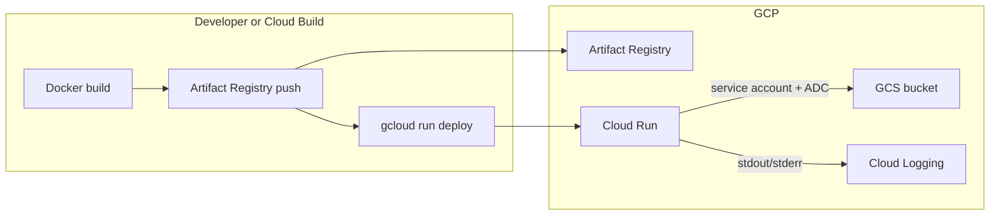

# GCP usage: flow and functionality check

This document describes how this repository uses **Google Cloud** (GCS, Cloud Run, Artifact Registry, Cloud Build, IAM) and how to sanity-check that behavior.

---

## What uses GCP vs what does not

| Area | Uses GCP? | Notes |
|------|-----------|--------|
| **File upload / download** | **Yes** | `google-cloud-storage` → **GCS** only when `GCS_BUCKET` is set |
| **Hosting the API** | **Yes (when you deploy)** | **Cloud Run** (container from `Dockerfile`) |
| **Container images** | **Yes (when you deploy)** | **Artifact Registry** (`docker build` / push / Cloud Build) |
| **CI/CD** | **Yes (optional)** | `cloudbuild.yaml` → build → push → `gcloud run deploy` |
| **IAM / setup** | **Yes (ops scripts)** | `scripts/gcp/*.sh` — not invoked by the application |
| **Gemini / grocery APIs** | **No (not GCP infra)** | `GEMINI_API_KEY` and external HTTP APIs; not Cloud Run / GCS / Vertex in this layer |

**In short:** in-app GCP usage is **GCS for the files API**. Everything else is **how you deploy and operate** on GCP.

---

## End-to-end deployment flow

When you use the shell scripts or Cloud Build:

1. Image is built and pushed to **Artifact Registry**.
2. **Cloud Run** runs that image with **`--service-account=backend-run-sa@...`** (or your chosen runtime SA).
3. That service account must have permission on the bucket you set in **`GCS_BUCKET`** (bucket-level IAM is recommended).
4. Process **stdout/stderr** is sent to **Cloud Logging** automatically on Cloud Run.

---

## Request flow: file APIs (runtime)

These routes are what talk to GCP (GCS):

| Method | Path | Behavior |
|--------|------|----------|
| `POST` | `/api/v1/upload` | Multipart file → memory (up to 100 MiB) → object `uploads/{uuid}` via `gcs_storage.upload_bytes` |
| `GET` | `/api/v1/file/{file_id}` | Object `uploads/{file_id}` via `gcs_storage.download_bytes` |

**Configuration**

- Bucket name: environment variable **`GCS_BUCKET`** → `Settings.gcs_bucket` in `app/config.py`.
- If `GCS_BUCKET` is unset or empty → **503** *“File storage is not configured (set GCS_BUCKET).”* — no GCS calls.

**Authentication to GCS**

- `storage.Client()` uses **Application Default Credentials (ADC)**.
- **On Cloud Run:** the **attached service account** identity (no JSON key file in the repo).
- **Locally:** ADC must be available (e.g. `gcloud auth application-default login` or `GOOGLE_APPLICATION_CREDENTIALS`), and `GCS_BUCKET` must be set, or uploads/downloads will fail with auth/config errors.

**Relevant files**

- `app/services/gcs_storage.py` — GCS client and upload/download helpers.
- `app/api/files.py` — FastAPI routes.
- `app/main.py` — mounts the files router under `/api/v1`.

---

## Functionality checklist

| Check | How |
|--------|-----|
| **App runs without GCS** | `GET /health` does not require GCS. |
| **503 when bucket not configured** | Unset `GCS_BUCKET`, call `POST /api/v1/upload` → expect 503. |
| **Happy path** | Set `GCS_BUCKET`, valid ADC + bucket IAM → `POST /api/v1/upload` returns `{ id, gcs_uri }`; `GET /api/v1/file/{id}` returns bytes (and `Content-Type` from GCS when present). |
| **Cloud Build deploy** | `cloudbuild.yaml` sets `GCS_BUCKET=${_GCS_BUCKET}` — configure substitution **`_GCS_BUCKET`** on the trigger. App secrets (e.g. `GEMINI_API_KEY`) should be supplied via Console or Secret Manager as noted in `cloudbuild.yaml` comments. |

---

## Summary

- **Application code** uses GCP **only for object storage** (`google-cloud-storage` + `GCS_BUCKET` + runtime service account).
- **Cloud Run, Artifact Registry, Cloud Build, and IAM** are **operational**: `scripts/gcp/` and `cloudbuild.yaml`; they are not imported by FastAPI.
- The rest of the backend (parsing, Gemini, autocomplete, etc.) does **not** call GCS or Cloud Run APIs in code; it runs **wherever** the container is hosted (including Cloud Run).
